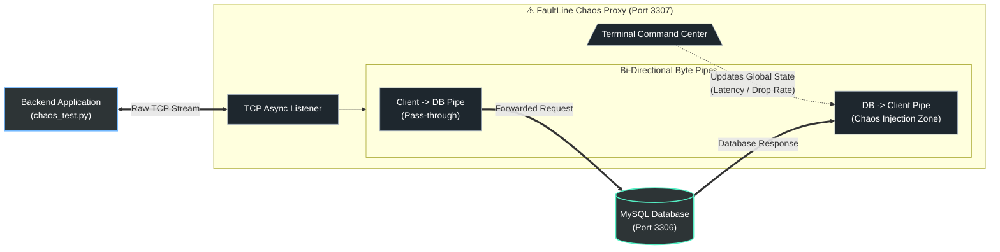

# ⚠️ FaultLine
**A localized Chaos Engineering proxy for backend database connections.**

Production databases lock up. Networks drop packets. Queries time out. 
FaultLine is a multi-threaded TCP proxy designed to sit between your local backend application and your database, allowing you to manually inject latency and drop connections in real-time to test the resilience of your code.

### ⚙️ The Architecture
FaultLine operates as an asynchronous Man-in-the-Middle (MITM) proxy at the TCP/IP layer. 

- **Traffic Interception:** Built with Python `asyncio` to natively handle high-concurrency byte streams without blocking.
- **Live Command Center:** Utilizes background thread delegation to allow developers to issue real-time network manipulation commands while data is actively flowing.
- **Protocol Agnostic:** Forwards raw bytes, meaning it works out-of-the-box with MySQL, PostgreSQL, Redis, or any TCP-based connection.

### 🚀 Usage 
1. Start your local database (e.g., MySQL on port 3306).
2. Start the proxy: `python faultline.py` (Listens on port 3307).
3. Point your backend application's connection string to `127.0.0.1:3307`.
4. Use the FaultLine command terminal to manipulate the live stream.

**Live Commands:**
* `latency 2.5` - Holds all database responses for 2.5 seconds.
* `drop 0.15` - Randomly terminates 15% of all active TCP connections.
* `status` - Displays current chaos parameters.
* `reset` - Restores network flow to normal.

### 🛡️ Why Build This?
To force developers to write self-healing, resilient code. If your backend crashes because a database connection drops, your architecture is fragile. FaultLine brings the harsh realities of production networking to your local environment.
